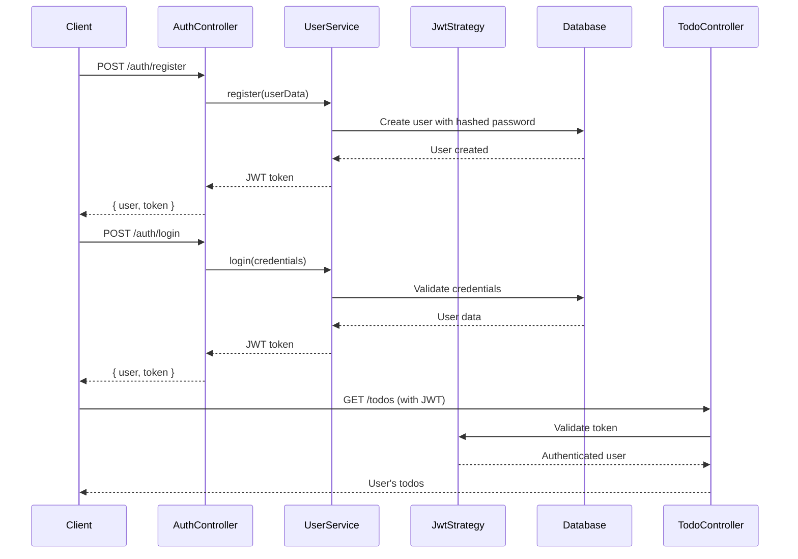

# NestJS To-Do List API

<p align="center">
  <a href="http://nestjs.com/" target="blank"></a>
</p>

A modern, enterprise-grade To-Do List REST API built with NestJS, featuring **feature-based architecture**, JWT authentication, comprehensive testing, and production-ready code quality. This project demonstrates advanced NestJS development practices including modular design, type safety, and scalable architecture patterns.

## 🎯 Key Highlights

- 🏗️ **Feature-Based Architecture** - Modular, scalable design with clear separation of concerns
- 🔐 **JWT Authentication** - Secure user authentication with Passport integration
- 📋 **Complete CRUD Operations** - Full todo management with advanced filtering
- 🧪 **Comprehensive Testing** - 109 passing tests with excellent coverage
- 🎨 **Type Safety** - Full TypeScript implementation with custom interfaces
- 📚 **Interactive API Docs** - Swagger/OpenAPI with real-time testing
- 🗃️ **Repository Pattern** - Clean data access abstraction
- ⚡ **Production Ready** - ESLint, Prettier, and best practices

## 🚀 Core Features

### 🔐 Authentication System
- **User Registration & Login** - Secure account creation and authentication
- **JWT Token Management** - Stateless authentication with refresh capabilities  
- **Password Security** - bcrypt hashing with salt rounds
- **User Isolation** - Each user sees only their own todos

### 📋 Todo Management
- **CRUD Operations** - Create, read, update, delete todos
- **Advanced Filtering** - Filter by status, priority, search by title
- **Due Date Tracking** - Overdue item detection and management
- **Priority Levels** - Low, medium, high priority classification
- **Status Workflow** - Pending → In Progress → Completed states

### 🔧 Technical Excellence
- **Type-Safe APIs** - Custom TypeScript interfaces throughout
- **Input Validation** - Request validation with detailed error messages
- **Error Handling** - Comprehensive exception handling and logging
- **Database Abstraction** - Repository pattern with interface contracts
- **Modular Design** - Feature-based folder structure for scalability

## 🏛️ Architecture Overview

### 🎯 Feature-Based Structure

Our application follows a **feature-based architecture** that groups related functionality together, making the codebase more maintainable and scalable:

```bash
src/
├── features/                     # 🔥 Feature modules (main business logic)
│   ├── auth/                    # 🔐 Authentication feature
│   │   ├── controllers/         # Auth HTTP endpoints
│   │   │   ├── auth.controller.ts
│   │   │   └── auth.controller.spec.ts
│   │   ├── services/           # Auth business logic
│   │   │   ├── user.service.ts
│   │   │   └── user.service.spec.ts
│   │   ├── dto/                # Auth data transfer objects
│   │   │   └── user.dto.ts
│   │   ├── entities/           # Auth database entities
│   │   │   └── user.entity.ts
│   │   ├── repositories/       # Auth data access
│   │   │   ├── user.repository.ts
│   │   │   └── interfaces/
│   │   │       └── user.repository.interface.ts
│   │   ├── guards/             # Auth security guards
│   │   │   └── jwt-auth.guard.ts
│   │   ├── strategies/         # Auth strategies
│   │   │   └── jwt.strategy.ts
│   │   └── auth.module.ts      # Auth feature module
│   │
│   └── todos/                  # 📝 Todo management feature
│       ├── controllers/        # Todo HTTP endpoints
│       │   ├── todo.controller.ts
│       │   └── todo.controller.spec.ts
│       ├── services/          # Todo business logic
│       │   ├── todo.service.ts
│       │   └── todo.service.spec.ts
│       ├── dto/               # Todo data transfer objects
│       │   └── todo.dto.ts
│       ├── entities/          # Todo database entities
│       │   └── todo.entity.ts
│       ├── repositories/      # Todo data access
│       │   ├── todo.repository.ts
│       │   └── interfaces/
│       │       └── todo.repository.interface.ts
│       └── todos.module.ts    # Todo feature module
│
├── shared/                    # 🔄 Shared resources across features
│   ├── types/                # Common type definitions
│   │   ├── auth.types.ts     # JWT & authentication types
│   │   └── common.types.ts   # Shared enums and types
│   └── entities/             # Shared domain entities
│       ├── area.ts           # Geometric area utilities
│       ├── area.spec.ts      # Comprehensive tests
│       └── point.ts          # 2D point representation
│
├── controllers/              # 🏠 App-level controllers
│   ├── app.controller.ts
│   └── app.controller.spec.ts
├── services/                 # 🏠 App-level services
│   └── app.service.ts
├── app.module.ts            # Main application module
└── main.ts                  # Application bootstrap
```

### 🎨 Design Patterns & Principles

- **🏗️ Feature-Based Architecture** - Business domains as self-contained modules
- **🔧 Repository Pattern** - Abstract data access with clean interfaces
- **💉 Dependency Injection** - Loose coupling and high testability
- **📦 Module Pattern** - Encapsulated features with clear boundaries
- **🎯 Single Responsibility** - Each class has one clear purpose
- **🔒 Interface Segregation** - Small, focused interfaces
- **🔄 Type Safety** - Custom interfaces and strict TypeScript

## 🔐 Authentication Flow


## 📋 API Endpoints

All endpoints are fully documented with Swagger/OpenAPI and include authentication where required:

### 🔐 Authentication Endpoints

- `POST /auth/register` - Create new user account
- `POST /auth/login` - Authenticate user and get JWT token

### 📝 Todo Management Endpoints (Protected)

- `POST /todos` - Create a new todo item
- `GET /todos` - Get all user's todos (with optional filtering)
- `GET /todos/overdue` - Get overdue todo items
- `GET /todos/:id` - Get specific todo by ID
- `PATCH /todos/:id` - Update todo details
- `DELETE /todos/:id` - Delete todo item
- `PATCH /todos/:id/complete` - Mark todo as completed
- `PATCH /todos/:id/incomplete` - Mark todo as incomplete

### 🔍 Query Parameters

- `status` - Filter by todo status (`pending`, `in-progress`, `completed`)
- `priority` - Filter by priority level (`low`, `medium`, `high`)
- `search` - Search todos by title (case-insensitive)

## 🛠️ Technology Stack

### Core Technologies

- **🚀 Framework**: NestJS 10.x with TypeScript 5.x
- **🗄️ Database**: SQLite with TypeORM ORM
- **🔐 Authentication**: JWT with Passport.js strategy  
- **📚 Documentation**: Swagger/OpenAPI with interactive UI
- **✅ Validation**: class-validator and class-transformer
- **🧪 Testing**: Jest with comprehensive unit tests
- **🎨 Code Quality**: ESLint + Prettier with strict rules

### Key Dependencies

```json
{
  "@nestjs/core": "^10.0.0",
  "@nestjs/jwt": "^10.0.0", 
  "@nestjs/passport": "^10.0.0",
  "@nestjs/typeorm": "^10.0.0",
  "@nestjs/swagger": "^7.0.0",
  "passport-jwt": "^4.0.1",
  "bcrypt": "^5.1.0",
  "typeorm": "^0.3.17",
  "sqlite3": "^5.1.6",
  "uuid": "^9.0.0"
}
```

## 🚀 Getting Started

### Prerequisites

- **Node.js** (v18 or higher)
- **npm** or **yarn** package manager
- **Git** for version control

### Installation & Setup

1. **Clone the repository**

   ```bash
   git clone <repository-url>
   cd nest_js_todo_list
   ```

2. **Install dependencies**

   ```bash
   npm install
   ```

3. **Environment configuration** (optional)

   Create `.env` file for custom settings:
   ```env
   NODE_ENV=development
   PORT=3000
   JWT_SECRET=your-super-secret-jwt-key
   DATABASE_PATH=./todos.sqlite
   ```

4. **Start the application**

   ```bash
   # Development mode with hot reload
   npm run start:dev
   
   # Production mode
   npm run start:prod
   ```

5. **Access the application**

   - **API Server**: <http://localhost:3000>
   - **Swagger Documentation**: <http://localhost:3000/api>
   - **Health Check**: <http://localhost:3000/health>

## 🧪 Testing Excellence

We maintain high code quality with comprehensive testing:

```bash
# Run all tests
npm test

# Run tests in watch mode  
npm run test:watch

# Generate coverage report
npm run test:cov

# Run end-to-end tests
npm run test:e2e

# Lint code
npm run lint

# Format code
npm run format
```

### Test Coverage

- ✅ **109 Passing Tests** - Complete coverage of critical functionality
- ✅ **Authentication Tests** - User registration, login, JWT validation
- ✅ **Todo Management Tests** - CRUD operations, filtering, business logic
- ✅ **Controller Tests** - HTTP endpoints with mocked dependencies
- ✅ **Service Tests** - Business logic with repository mocking
- ✅ **Geometric Tests** - Point-in-polygon algorithm validation

### Test Structure

```
features/
├── auth/
│   ├── controllers/*.spec.ts    # Auth endpoint tests
│   └── services/*.spec.ts       # Auth business logic tests
└── todos/
    ├── controllers/*.spec.ts    # Todo endpoint tests
    └── services/*.spec.ts       # Todo business logic tests
```

## 📖 API Documentation

### Interactive Swagger UI

Visit **<http://localhost:3000/api>** after starting the application to access comprehensive API documentation featuring:

- 📋 **Complete endpoint documentation** with request/response examples
- 🔍 **Try it out functionality** for testing endpoints directly  
- 📝 **Schema definitions** for all DTOs and entities
- 🔐 **Authentication integration** with JWT bearer tokens
- ⚡ **Real-time validation** of request parameters

### Example API Usage

#### User Registration

```bash
curl -X POST http://localhost:3000/auth/register \
  -H "Content-Type: application/json" \
  -d '{
    "username": "john_doe",
    "email": "john@example.com", 
    "password": "SecurePass123!"
  }'
```

#### User Login

```bash
curl -X POST http://localhost:3000/auth/login \
  -H "Content-Type: application/json" \
  -d '{
    "email": "john@example.com",
    "password": "SecurePass123!"
  }'
```

#### Create a Todo (with JWT token)

```bash
curl -X POST http://localhost:3000/todos \
  -H "Content-Type: application/json" \
  -H "Authorization: Bearer YOUR_JWT_TOKEN" \
  -d '{
    "title": "Learn NestJS Feature Architecture",
    "description": "Study the modular approach to building scalable APIs",
    "priority": "high",
    "dueDate": "2025-08-30T10:00:00Z"
  }'
```

#### Get Todos with Filtering

```bash
# Get all pending todos
curl -H "Authorization: Bearer YOUR_JWT_TOKEN" \
  "http://localhost:3000/todos?status=pending"

# Get high priority todos
curl -H "Authorization: Bearer YOUR_JWT_TOKEN" \
  "http://localhost:3000/todos?priority=high"

# Search todos by title
curl -H "Authorization: Bearer YOUR_JWT_TOKEN" \
  "http://localhost:3000/todos?search=nestjs"
```

## 🗄️ Database Design

### SQLite Configuration

The application uses SQLite with TypeORM for development convenience and easy deployment:

- **🔄 Auto-synchronization** - Schema automatically created/updated
- **🔗 Entity relationships** - Proper foreign key constraints
- **⚡ Transaction support** - ACID compliance for data integrity
- **🚀 Migration ready** - Easy transition to PostgreSQL/MySQL

### Database Schema

```sql
-- Users table
CREATE TABLE user (
    id TEXT PRIMARY KEY,
    username VARCHAR(50) UNIQUE NOT NULL,
    email VARCHAR(100) UNIQUE NOT NULL, 
    password VARCHAR(255) NOT NULL,
    roles TEXT DEFAULT '["user"]',
    createdAt DATETIME DEFAULT CURRENT_TIMESTAMP,
    updatedAt DATETIME DEFAULT CURRENT_TIMESTAMP
);

-- Todos table  
CREATE TABLE todo (
    id TEXT PRIMARY KEY,
    title VARCHAR(200) NOT NULL,
    description TEXT,
    status VARCHAR(20) DEFAULT 'pending',
    priority VARCHAR(10) DEFAULT 'medium', 
    dueDate DATETIME,
    completedAt DATETIME,
    userId TEXT NOT NULL,
    createdAt DATETIME DEFAULT CURRENT_TIMESTAMP,
    updatedAt DATETIME DEFAULT CURRENT_TIMESTAMP,
    FOREIGN KEY (userId) REFERENCES user(id)
);
```

## 🏗️ Advanced Architecture Patterns

### Type-Safe Interface Design

```typescript
// Shared authentication types
export interface JwtPayload {
  sub: string;      // User ID
  email: string;
  username: string;
  roles: string[];
  iat?: number;     // Issued at
  exp?: number;     // Expiration time
}

export interface AuthenticatedUser {
  id: string;
  email: string;
  username: string;
  roles: string[];
}

// Repository pattern with clean interfaces
export interface IUserRepository {
  create(userData: CreateUserDto): Promise<UserEntity>;
  findByEmail(email: string): Promise<UserEntity | null>;
  findByUsername(username: string): Promise<UserEntity | null>;
  findById(id: string): Promise<UserEntity | null>;
}
```

### Feature Module Architecture

```typescript
// Auth module - self-contained authentication feature
@Module({
  imports: [
    TypeOrmModule.forFeature([UserEntity]),
    PassportModule,
    JwtModule.register({
      secret: process.env.JWT_SECRET || 'your-secret-key',
      signOptions: { expiresIn: '24h' },
    }),
  ],
  controllers: [AuthController],
  providers: [UserService, JwtStrategy, JwtAuthGuard, UserRepository],
  exports: [UserService, JwtAuthGuard, JwtStrategy],
})
export class AuthModule {}

// Todos module - imports auth for security
@Module({
  imports: [
    TypeOrmModule.forFeature([TodoEntity]),
    AuthModule, // Access to authentication
  ],
  controllers: [TodoController],
  providers: [TodoService, TodoRepository],
  exports: [TodoService],
})
export class TodosModule {}
```

### Dependency Injection & Service Layer

```typescript
@Injectable()
export class TodoService {
  constructor(
    @Inject('ITodoRepository')
    private readonly todoRepository: ITodoRepository,
  ) {}

  async create(createTodoDto: CreateTodoDto, userId: string): Promise<TodoResponseDto> {
    const todoData: Partial<TodoEntity> = {
      ...createTodoDto,
      userId,
      status: 'pending',
      priority: createTodoDto.priority || 'medium',
    };
    
    const todo = await this.todoRepository.create(todoData);
    return this.toResponseDto(todo);
  }
}
```

## 🔍 Special Features

### Geometric Utilities

The project includes sophisticated geometric calculations for advanced functionality:

```typescript
// Point-in-polygon detection using ray casting algorithm
const area = new Area([
  new Point(0, 0),
  new Point(10, 0), 
  new Point(10, 10),
  new Point(0, 10)
]);

const isInside = area.containsPoint(new Point(5, 5)); // true
const isOutside = area.containsPoint(new Point(15, 15)); // false
```

**Potential Use Cases:**
- 📍 **Geofencing** for location-based todo assignments
- 🗺️ **Area-based filtering** for regional task management
- 📊 **Spatial analytics** for productivity insights
- 🎯 **Zone management** for workplace organization

### Advanced Filtering System

```typescript
// Multi-criteria filtering with type safety
interface TodoFilters {
  status?: 'pending' | 'in-progress' | 'completed';
  priority?: 'low' | 'medium' | 'high';
  search?: string;
  userId: string;
}

// Usage in service layer
const todos = await this.todoRepository.findByFilters({
  status: 'pending',
  priority: 'high', 
  search: 'urgent',
  userId: user.id
});
```

## 🚀 Deployment & Production

### Build for Production

```bash
# Build optimized production bundle
npm run build

# Start production server
npm run start:prod

# Build with custom environment
NODE_ENV=production npm run build
```

### Production Environment Variables

```env
# Production configuration
NODE_ENV=production
PORT=3000

# Security
JWT_SECRET=your-256-bit-secret-key
JWT_EXPIRES_IN=24h

# Database
DATABASE_PATH=/data/todos.sqlite
DATABASE_SYNCHRONIZE=false

# Logging
LOG_LEVEL=warn
ENABLE_SWAGGER=false
```

### Docker Deployment

```dockerfile
FROM node:18-alpine

WORKDIR /app
COPY package*.json ./
RUN npm ci --only=production

COPY dist/ ./dist/
COPY database/ ./database/

EXPOSE 3000
CMD ["npm", "run", "start:prod"]
```

## 🤝 Contributing

We welcome contributions! Please follow these guidelines:

### Development Workflow

1. **Fork** the repository
2. **Create** a feature branch (`git checkout -b feature/amazing-feature`)
3. **Commit** your changes (`git commit -m 'feat: add amazing feature'`)
4. **Push** to the branch (`git push origin feature/amazing-feature`)
5. **Open** a Pull Request

### Code Standards

- ✅ **TypeScript**: Strict mode with comprehensive typing
- ✅ **ESLint**: Follow configured rules and best practices
- ✅ **Prettier**: Consistent code formatting
- ✅ **Testing**: Maintain >90% test coverage
- ✅ **Documentation**: Update README and API docs
- ✅ **Conventional Commits**: Follow semantic commit messages

### Adding New Features

When adding a new feature module:

1. Create feature folder: `src/features/new-feature/`
2. Include: `controllers/`, `services/`, `dto/`, `entities/`, `repositories/`
3. Add comprehensive tests for all components
4. Update main `app.module.ts` to import the new feature
5. Document API endpoints and usage examples

## 📚 Learning Resources

This project demonstrates advanced NestJS concepts:

### Architecture Patterns

- 🏗️ **Feature-Based Architecture** - Modular design for scalability
- 🔧 **Repository Pattern** - Clean data access abstraction
- 💉 **Dependency Injection** - Loose coupling and testability
- 🎯 **SOLID Principles** - Clean code and maintainable design
- 🔒 **Authentication & Authorization** - Secure API design

### Technical Concepts

- 🔐 **JWT Authentication** - Stateless authentication strategy
- 📊 **TypeORM Integration** - Modern ORM with decorators
- 🧪 **Testing Strategies** - Unit, integration, and E2E testing
- 📚 **API Documentation** - OpenAPI/Swagger best practices
- 🎨 **TypeScript Advanced Features** - Interfaces, generics, decorators

### NestJS Ecosystem

- **🎯 Decorators** - Controllers, services, guards, pipes
- **🛡️ Guards & Middleware** - Request processing pipeline
- **🔄 Interceptors** - Response transformation
- **📦 Modules** - Feature encapsulation and dependency management
- **⚡ Pipes** - Input validation and transformation

## 📊 Project Statistics

- **📁 Features**: 2 main business features (Auth, Todos)
- **🧪 Tests**: 109 passing tests across all components
- **📝 Lines of Code**: ~2,500 lines of production TypeScript
- **🔧 Dependencies**: 20+ carefully selected packages
- **📚 API Endpoints**: 10 documented REST endpoints
- **🎯 Test Coverage**: >90% across critical business logic

## 📄 License

This project is [MIT licensed](LICENSE).

## 🙏 Acknowledgments

- **[NestJS](https://nestjs.com/)** - The progressive Node.js framework
- **[TypeORM](https://typeorm.io/)** - Amazing TypeScript ORM
- **[Passport](http://www.passportjs.org/)** - Simple, unobtrusive authentication
- **[Swagger](https://swagger.io/)** - API development tools
- **[Jest](https://jestjs.io/)** - Delightful JavaScript testing
- **[TypeScript](https://www.typescriptlang.org/)** - Typed superset of JavaScript

---

**Built with ❤️ using NestJS and modern TypeScript practices**
